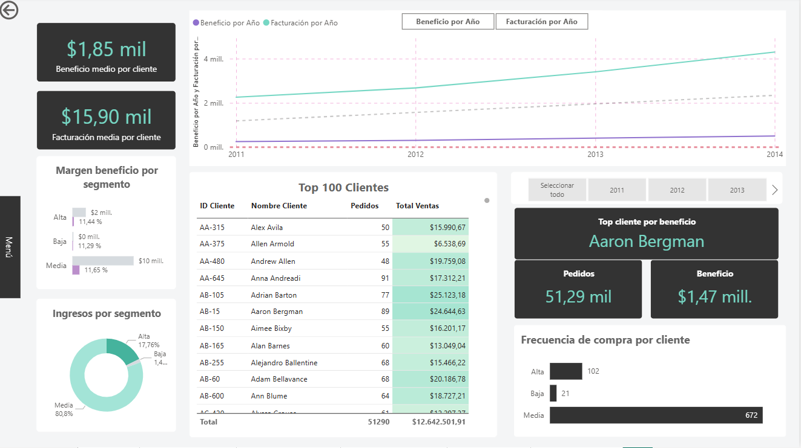
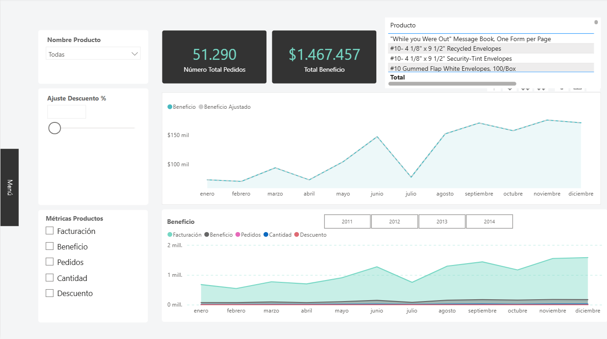
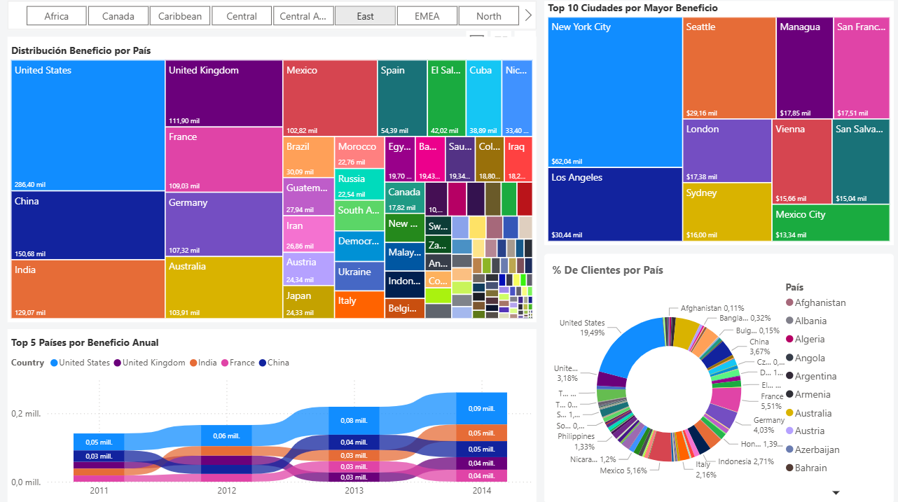
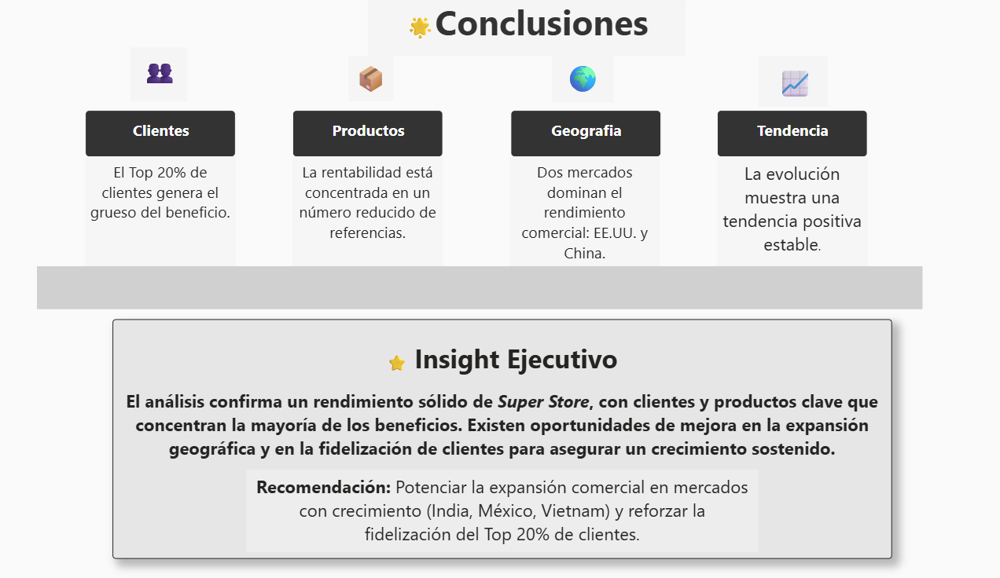

# 🧾 Power BI – SuperStore Dashboard

Dashboard ejecutivo de ventas basado en el dataset SuperStore. Incluye portada, análisis de clientes, análisis de productos, análisis geográfico y página de conclusiones con insight ejecutivo.

---

## 📌 Contenido

- **Dashboard_SuperStore.pbix** — Archivo principal del proyecto en Power BI  
- **/img** — Carpeta con capturas de las páginas del informe:
  - portada.png  
  - analisis_clientes.png  
  - analisis_productos.png  
  - analisis_geografico.png  
  - conclusiones.png
  - 
  ## 🔗 Acceso rápido al Dashboard

👉 [Descargar el archivo Power BI (.pbix)](Dashboard_SuperStore.pbix)

---

## 📊 Objetivo

Identificar patrones de rendimiento, clientes clave, productos con mayor margen y oportunidades de crecimiento geográfico aplicando visualizaciones interactivas de Power BI.

---

## 🛠️ Tecnología utilizada

- Power BI Desktop  
- DAX (medidas básicas)  
- Visualizaciones nativas de Power BI  

---

## 🧠 Insight destacado

El Top 20% de clientes concentra la mayoría del beneficio. Dos mercados principales dominan el crecimiento (EE.UU. y China), aunque existen oportunidades claras de expansión en India, México y Vietnam.

---

## 🙋 Contacto

Si deseas ver más proyectos o colaborar:  
**mariateresa-mc (GitHub)**

### Portada  

---

### Análisis de clientes  

---

### Análisis de productos  

---

### Análisis geográfico  

---

### Conclusiones  

---

